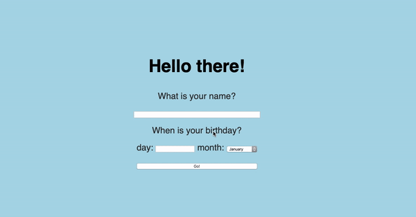

# Birthday App

Challenge to build a web app that will ask the user for a name and birthday.


## How does it work?
The user submits the form, and depending on the current date, the app will either:

* wish the user happy birthday
* tell them how long they'll have to wait until their next birthday

 

## How to run ##

```shell
# To run the birthday_app
rrackup -p 9393     

# To run in browser
http://localhost:9393/

```

